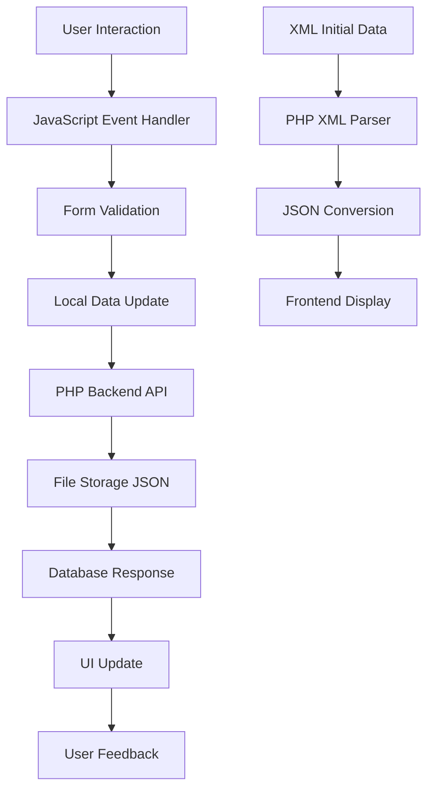

# 🌿 Plant Catalog Management System - Educational Analysis & Documentation

## 📋 Overview and Purpose

The **Plant Catalog Management System** is a comprehensive web application designed for managing plant inventory data with an elegant garden-themed interface. This educational project demonstrates modern web development practices through a real-world use case that could serve nurseries, botanical gardens, or educational institutions.

**Core Objectives:**
- Provide intuitive plant data management (Create, Read, Update, Delete operations)
- Demonstrate responsive web design principles
- Show integration between frontend and backend technologies
- Implement real-time search and data validation
- Practice XML/JSON data handling and persistence

**Intended Users:**
- Web development students learning full-stack concepts
- Plant enthusiasts managing collections
- Small nursery businesses tracking inventory
- Educational institutions teaching botany

## 🏗️ Architecture and Technology Stack

### Frontend Technologies
- **HTML5** (`index.html:1-776`) - Semantic structure with accessibility features
- **CSS3** (`index.html:8-662`) - Modern styling using CSS custom properties, Flexbox, and Grid
- **Bootstrap 5.1.3** (`index.html:7`) - Responsive component framework
- **Vanilla JavaScript** (`script.js:1-495`) - No frameworks, demonstrating core DOM manipulation

### Backend Technologies
- **PHP** (`backend.php:1-83`) - Server-side data processing and API endpoints
- **File-based storage** - JSON for runtime data, XML for initial seed data

### Data Flow Architecture
```
Frontend (HTML/CSS/JS) ↔ PHP Backend ↔ File Storage (JSON/XML)
     ↑                      ↑              ↑
 User Interface        API Endpoints    Data Persistence
```

**Key Architectural Decisions:**
1. **Single Page Application (SPA)** - All functionality in one HTML file
2. **Progressive Enhancement** - Graceful fallback from PHP to XML loading
3. **File-based Storage** - Simple persistence without database complexity
4. **RESTful API Pattern** - Clean separation between frontend and backend

## 🔧 Core Features Breakdown

### 1. CRUD Operations (`script.js:200-250`)

**Add Plant Function:**
```javascript
function addPlant() {
    const formData = getFormData();
    if (!validateForm(formData)) return;
    
    const newPlant = {
        id: plantsData.length > 0 ? Math.max(...plantsData.map(p => p.id)) + 1 : 1,
        ...formData
    };
    
    plantsData.push(newPlant);
    savePlantsData();
    displayPlantsTable();
    clearForm();
    showNotification("Plant added successfully!", "success");
}
```

**Educational Value:**
- Demonstrates form validation before processing
- Shows ID generation using array methods
- Illustrates data persistence workflow
- Implements user feedback through notifications

### 2. Real-time Search (`script.js:302-325`)

```javascript
function filterPlantsTable(searchTerm) {
    const tbody = document.querySelector("#plantTable tbody");
    const rows = tbody.querySelectorAll("tr");
    
    if (!searchTerm.trim()) {
        rows.forEach(row => row.style.display = "");
        return;
    }
    
    const searchLower = searchTerm.toLowerCase();
    
    rows.forEach(row => {
        const cells = row.querySelectorAll("td");
        let found = false;
        
        cells.forEach(cell => {
            if (cell.textContent.toLowerCase().includes(searchLower)) {
                found = true;
            }
        });
        
        row.style.display = found ? "" : "none";
    });
}
```

**Key Learning Points:**
- DOM traversal and manipulation
- Event-driven programming with input listeners
- String matching and case-insensitive search
- Dynamic UI updates without page refresh

### 3. Form Validation (`script.js:389-423`)

```javascript
function validateForm(data, isUpdate = false) {
    const requiredFields = {
        common: 'Common Name',
        botanical: 'Botanical Name',
        zone: 'Zone',
        light: 'Light Requirements',
        price: 'Price',
        availability: 'Availability'
    };
    
    // Required field validation
    for (let key in requiredFields) {
        if (!data[key] || data[key].trim() === '') {
            showNotification(`Please fill in the ${requiredFields[key]} field.`, 'error');
            document.getElementById(key).focus();
            return false;
        }
    }
    
    // Price validation
    const priceValue = data.price.replace('$', '');
    const price = parseFloat(priceValue);
    if (isNaN(price) || price < 0) {
        showNotification('Please enter a valid price (positive number).', 'error');
        document.getElementById('price').focus();
        return false;
    }
    
    // Duplicate checking
    if (!isUpdate && isDuplicatePlant(data)) {
        return false;
    }
    
    return true;
}
```

## 🎨 User Interface and UX Design

### Garden-themed Design System (`index.html:15-55`)

**CSS Custom Properties for Consistency:**
```css
:root {
    /* Color Palette */
    --primary-green: #667c5c;
    --secondary-green: #85a378;
    --tertiary-green: #a8c69b;
    --light-green: #c7e0be;
    --lightest-green: #e8f4e5;
    
    /* Spacing Scale */
    --spacing-xs: 0.25rem;
    --spacing-sm: 0.5rem;
    --spacing-md: 0.75rem;
    --spacing-lg: 1rem;
    
    /* Typography Scale */
    --font-xs: 0.75rem;
    --font-sm: 0.85rem;
    --font-md: 0.95rem;
}
```

**Responsive Design Strategy:**
- **Mobile-first approach** with progressive enhancement
- **Flexbox and CSS Grid** for layout management (`index.html:89-97`)
- **Bootstrap breakpoints** supplemented with custom media queries
- **Touch-friendly interactions** for mobile devices

### Visual Hierarchy and Accessibility
- **Semantic HTML structure** with proper heading levels
- **ARIA labels** and keyboard navigation support
- **High contrast ratios** meeting WCAG guidelines
- **Focus management** for form interactions

## 🔗 Backend and Data Handling

### PHP API Structure (`backend.php:57-82`)

```php
$action = isset($_GET['action']) ? $_GET['action'] : (isset($_POST['action']) ? $_POST['action'] : '');

switch ($action) {
    case 'load':
        $plants = loadPlantsData();
        echo json_encode($plants);
        break;
        
    case 'save':
        if (isset($_POST['data'])) {
            $data = json_decode($_POST['data'], true);
            if ($data !== null) {
                $success = savePlantsData($data);
                echo json_encode(['success' => $success, 'message' => $success ? 'Data saved successfully' : 'Failed to save data']);
            }
        }
        break;
}
```

**Educational Insights:**
- **RESTful API design** with action-based routing
- **JSON data exchange** between frontend and backend
- **Error handling** with meaningful response messages
- **File I/O operations** for data persistence

### Data Integration Strategy

**XML to JSON Conversion (`backend.php:9-32`):**
```php
function loadPlantsFromXML() {
    $xml = simplexml_load_file('plant_catalog.xml');
    $plants = [];
    $id = 1;
    
    foreach ($xml->PLANT as $plant) {
        $plants[] = [
            'id' => $id++,
            'common' => (string)$plant->COMMON,
            'botanical' => (string)$plant->BOTANICAL,
            'zone' => (string)$plant->ZONE,
            'light' => (string)$plant->LIGHT,
            'price' => (string)$plant->PRICE,
            'availability' => (string)$plant->AVAILABILITY
        ];
    }
    
    return $plants;
}
```

**Fallback Strategy (`script.js:18-31`):**
```javascript
function loadPlantsData() {
    fetch('backend.php?action=load')
        .then(response => response.json())
        .then(data => {
            plantsData = data;
            populateZoneDropdown();
            populateLightDropdown();
            displayPlantsTable();
        })
        .catch(error => {
            console.error('Error loading plants data:', error);
            loadFromXML(); // Fallback to direct XML loading
        });
}
```

## 💡 Best Practices and Notable Implementations

### 1. Duplicate Prevention (`script.js:425-444`)
**Smart duplicate detection** using both common and botanical names:
```javascript
function isDuplicatePlant(newPlantData) {
    const duplicates = plantsData.filter((plant, index) => {
        if (index === selectedPlantIndex) return false;
        
        const commonMatch = plant.common.toLowerCase().trim() === newPlantData.common.toLowerCase().trim();
        const botanicalMatch = plant.botanical.toLowerCase().trim() === newPlantData.botanical.toLowerCase().trim();
        
        return commonMatch && botanicalMatch;
    });
    
    if (duplicates.length > 0) {
        showNotification(`A plant with the name "${duplicates[0].common}" already exists.`, 'error');
        return true;
    }
    
    return false;
}
```

### 2. Dynamic Dropdown Population (`script.js:92-111`)
**Data-driven UI components** that adapt to actual content:
```javascript
function populateLightDropdown() {
    const lightSelect = document.getElementById('light');
    const lightValues = plantsData.map(plant => plant.light);
    
    // Get unique light values only
    const uniqueLights = [...new Set(lightValues)].sort();
    
    // Keep the default "Choose light..." option
    lightSelect.innerHTML = '<option value="">Choose light...</option>';
    
    // Add only unique light values from XML data
    uniqueLights.forEach(light => {
        const option = document.createElement('option');
        option.value = light;
        option.textContent = light;
        lightSelect.appendChild(option);
    });
}
```

### 3. Enhanced Notification System (`script.js:355-386`)
**Smooth animations and user feedback**:
```javascript
function showNotification(message, type = 'success') {
    // Remove existing notifications with fade out
    const existingNotification = document.querySelector('.notification');
    if (existingNotification) {
        existingNotification.classList.add('fade-out');
        setTimeout(() => {
            if (existingNotification.parentNode) {
                existingNotification.remove();
            }
        }, 300);
    }
    
    // Create and show new notification
    const notification = document.createElement('div');
    notification.className = `notification notification-${type}`;
    notification.textContent = message;
    document.body.appendChild(notification);
    
    // Auto-remove after 4 seconds
    setTimeout(() => {
        if (notification.parentNode) {
            notification.classList.add('fade-out');
            setTimeout(() => notification.remove(), 300);
        }
    }, 4000);
}
```

### 4. Modular CSS Architecture
**Scalable styling system** using CSS custom properties and component-based approach:
```css
/* Consistent button styling */
.btn {
    padding: 0.5rem 1rem;
    font-size: 0.825rem;
    font-weight: 600;
    border-radius: 8px;
    transition: all 0.3s ease;
    border: none;
}

.btn-success {
    background: linear-gradient(135deg, #4caf50, #66bb6a);
    color: white;
    box-shadow: 0 2px 8px rgba(76, 175, 80, 0.3);
}
```

## 📚 Recommendations for Students

### 🎯 Focus Areas for Learning

1. **JavaScript Fundamentals**
   - Study the event handling patterns in `setupSearchFunctionality()` (`script.js:9-16`)
   - Understand array methods used in data manipulation
   - Practice async/await with the fetch API calls

2. **CSS Layout Techniques**
   - Examine the flexbox implementation in `.table-container` (`index.html:112-116`)
   - Study the responsive design patterns in media queries
   - Learn CSS custom properties for maintainable theming

3. **PHP Backend Concepts**
   - Understand the MVC-like separation in `backend.php`
   - Study file I/O operations and JSON handling
   - Learn about error handling and API design

4. **Data Management Patterns**
   - Observe the XML-to-JSON conversion strategy
   - Study the validation and sanitization techniques
   - Understand state management in client-side applications

### 🚀 Suggested Enhancements

1. **Database Integration**
   - Replace file-based storage with MySQL/PostgreSQL
   - Implement proper SQL queries and prepared statements
   - Add database schema design and migrations

2. **Advanced Features**
   - Add image upload for plants
   - Implement category/taxonomy system
   - Create plant care reminders and notes

3. **Security Improvements**
   - Add input sanitization and CSRF protection
   - Implement user authentication and authorization
   - Add rate limiting and input validation

4. **Performance Optimization**
   - Implement pagination for large datasets
   - Add client-side caching strategies
   - Optimize images and implement lazy loading

5. **Modern Development Practices**
   - Convert to a framework like React or Vue.js
   - Add automated testing (unit, integration, e2e)
   - Implement CI/CD pipeline and deployment strategies

### 🔍 Code Study Exercises

1. **Trace the data flow** from clicking "Add Plant" to seeing the new entry in the table
2. **Modify the validation rules** to add custom business logic
3. **Extend the search functionality** to include fuzzy matching or filters
4. **Redesign the CSS** using a different color scheme or layout approach
5. **Add a new field** (like "watering frequency") and implement it throughout the system

### 📖 Educational Value Summary

This project excellently demonstrates:
- **Separation of concerns** between presentation, logic, and data
- **Progressive enhancement** with graceful degradation
- **User experience best practices** with real-time feedback
- **Data integrity** through validation and duplicate prevention
- **Responsive design** principles for multi-device compatibility
- **API design** patterns for frontend-backend communication

The codebase serves as an excellent learning resource for understanding how modern web applications are structured, providing a solid foundation for students to build upon as they advance in web development.

## 📁 Project File Structure

```
Activity3_Plants/
├── index.html              # Main application file (776 lines)
├── script.js               # JavaScript functionality (495 lines)
├── backend.php             # Server-side data handling (83 lines)
├── plant_catalog.xml       # Initial plant data (36 plant records)
├── plants.json             # Runtime data storage
├── README.md               # Project documentation
└── EDUCATIONAL_ANALYSIS.md # This educational analysis
```

## 🔄 Data Flow Diagram



## 🛠️ Development Setup Instructions

1. **Prerequisites**
   - Web server with PHP support (Apache/Nginx)
   - Modern web browser
   - Text editor/IDE

2. **Installation**
   ```bash
   # Clone or download project files
   git clone [repository-url]
   cd Activity3_Plants
   
   # Start local server
   php -S localhost:8000
   # or place in web server document root
   ```

3. **File Permissions**
   ```bash
   # Ensure PHP can write to JSON file
   chmod 644 plants.json
   chmod 755 backend.php
   ```

4. **Testing**
   - Open `http://localhost:8000` in browser
   - Verify plant data loads from XML
   - Test CRUD operations
   - Check responsive design on different screen sizes

---

**Generated for educational purposes** 📚
*This analysis provides comprehensive insights into modern web development practices through a practical, real-world application.*